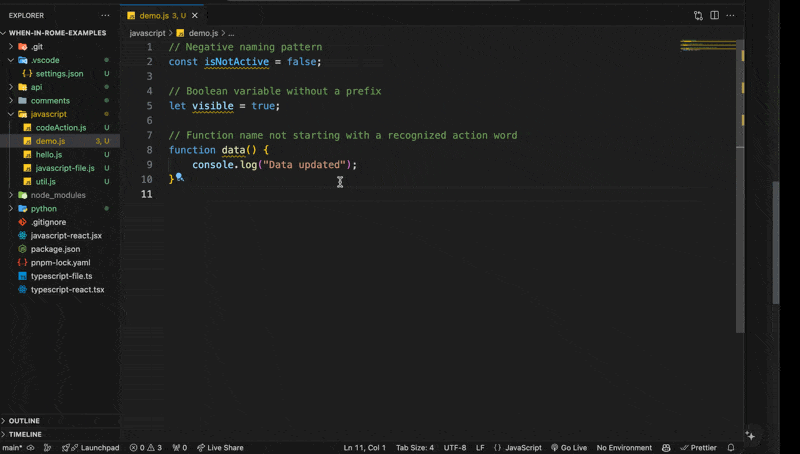

# When In Rome VSCode Extension

When In Rome is an AI-driven code stylist that helps teams enforce their coding conventions, reducing review cycles and improving code quality. Our tool ensures that the code adheres to team-defined conventions before submission, saving everyone valuable time.

## See It In Action

*Watch as When In Rome highlights coding convention violations and offers immediate, actionable recommendations for fixing them, streamlining your coding process.*

## Features ✨

- **AI-Driven Name Recommendations**: Automatically check variable and function names against your team’s coding conventions, ensuring consistency and readability.
- **Quick Fix Suggestions**: Receive suggestions to fix naming and style violations directly in your IDE, with options to apply changes immediately or review them first.
- **Configurable Rules**: Simple rule configurations are available directly within the extension settings panel, allowing you to customize naming and style guidelines to match your team's standards.
- **Redundant Comment Detection**: Automatically flags comments that do not contribute additional information or context to the code below them, helping to keep your codebase clean and efficient. Comments marked with '@rome-ignore', 'TODO', or 'FIXME' are intelligently ignored to preserve necessary notes.
- **Test Suite Conventions**: Notify developers to add or update test files when changes are detected in API views. *MVP: Triggers for files within "api" or "views" folders.*
- **Supports Multiple Languages**: Initial support for Python, JavaScript, and TypeScript, with plans to expand to more languages.

## Planned Features 🧭

- **Custom Rule Creation**: Define your team's custom rules or modify AI-enhanced templates to fit your project’s needs.
- **Flexible Configuration**: Customize the extension settings to align with your team's specific coding conventions, such as adjusting rule severity or excluding files.

## Quick Start 🏃‍♂️💨

1. **Install the Extension**: [VS Code Marketplace](#) (Add your marketplace link here)
2. **Configure Conventions**: Set up your team's coding conventions via a GUI or a configuration file.
3. **Start Coding**: Begin coding as usual while the extension monitors and helps improve your work.
4. **Review Violations**: Check and resolve any flagged violations in the Problems panel.

## Configuration 🧪

### Simple Rule Configuration

- **Enable/Disable**: Toggle the extension on or off.
- **Check New Code Only**: Limit checks to newly written or modified code to focus on current development.
- **Notification Interval**: Set how frequently you receive reminders to review suggestions for testing business logic.
- **Language-Specific Settings**: Adjust settings for JavaScript, TypeScript, and Python, including:
  - Toggle the extension on or off for the selected language.
  - Enforcing expressive variable names.
  - Avoiding abbreviations.
  - Using boolean variable prefixes.
  - Maintaining positive naming conventions.

These settings can be accessed by going to `Preferences → Settings → Extensions → When In Rome`.

## Usage 📖

1. **Setup and Configuration**: Install the extension and set up your team's coding conventions via a GUI or a configuration file.
2. **Code Analysis**: Real-time code analysis highlights any deviations from established conventions as you type.
3. **Quick Fixes**: Offers actionable recommendations for quick corrections, streamlining your coding process.
4. **Automatic Suggestions**: AI-driven suggestions help maintain consistency across your team's codebase.
5. **Test Suite Enforcement**: Alerts you to update or create tests following changes in designated "api" or "views" directories, ensuring code changes are adequately tested.

## Pricing 🤑

When In Rome is currently in alpha mode and under rapid development. However, we plan to convert this to a paid product with a monthly subscription plan. All new users get a 14-day free trial with full feature access.

## Feedback ✍️

We would love to hear your feedback! Please reach out to [support@rome.dev](mailto:support@rome.dev) for any questions, suggestions, or issues.

## Known Issues & Limitations 🐞

- **Initial Language Support**: Currently, only Python, JavaScript, and TypeScript are supported.
- **False Positives**: As an MVP undergoing rapid development, When In Rome may generate inaccurate diagnostics and recommendations. If you encounter any issues, please report them to [support@rome.dev](mailto:support@rome.dev).

## Contribution Guidelines 👯‍♀️

Interested in contributing to When In Rome? Please reach out to [hello@rome.dev](mailto:hello@rome.dev).

## License 👮‍♂️

When In Rome is a proprietary software application. Please review the [LICENSE.md](LICENSE) file for details.
